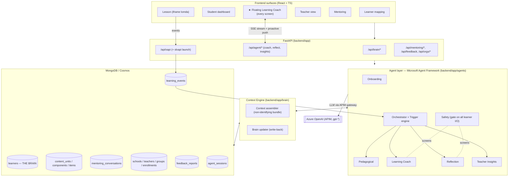
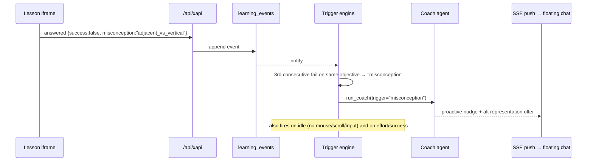
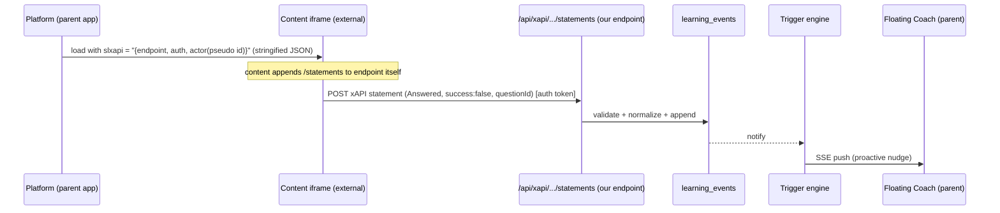

# Yuvilab Spark — Shared Learning Brain Architecture

> Canonical architecture for the 720 agentic system. This is the source of truth for how the
> **Shared Learning Brain (Context Engine)**, the **Microsoft Agent Framework** agent layer, the
> **frontend surfaces**, and the **content + xAPI pipeline** fit together — and how we retire the
> current mock/LLM‑invented data to make the product "legit".
>
> Audience: engineers implementing yuvi-720, and the `.github` agent toolchain (`720-content-builder`
> agent + `720-*` skills) which must treat this document as the architecture baseline.
>
> Related: `.github/skills/720-agent-architecture/SKILL.md`,
> `.github/skills/720-delivery-requirements/SKILL.md`,
> `.github/skills/720-content-standards/SKILL.md`,
> `.github/instructions/content-authoring.instructions.md`.

---

## 0. TL;DR

We are building **one AI mentor per student**. Everything the system knows about a learner lives in a
single **Learner Brain** document in MongoDB, keyed by a **non-identifying learner id**. A team of
specialized agents (Microsoft Agent Framework) **read from and write to that brain** — they never hold
private state of their own. A floating **Learning Coach** companion is available on every screen, talks
to the student in their language, and *actually relates to them* because the brain feeds it interests,
strengths, struggles, goals, and live learning events. The dashboards, teacher view, and mentoring
surfaces render **the same brain**, not mock data.

```
Questionnaire ─┐
Learning events ─┤→  LEARNER BRAIN (Context Engine, MongoDB)  →  Agents  →  Surfaces (React + floating chat)
Mentoring goals ─┤        ▲ read / ▼ write                         │
Teacher notes ───┘        └─────────────── agents update the brain ┘
```

---

## 1. Vision & the picture

The reference diagram ("720 LEARNING SYSTEM — A team of AI agents. One shared brain. Every student.")
defines six agents orbiting a central **Shared Learning Brain — The Context Engine**, over a
**Shared Context Memory** of: Student Profile, Goals, Progress, Learning History, Strengths,
Challenges, Preferences.

That picture maps 1:1 onto the 720 minimum requirements:

| Diagram agent | Purpose (from diagram) | 720 feature it satisfies | Weight |
|---|---|---|---|
| **1. Onboarding Agent** | Understands the student as a unique learner | F2 Initial learner mapping → seeds the brain | 5% |
| **2. Learning Coach Agent** | Guides, explains, supports in real time | F3 Learning agent / personal companion (floating chat, proactive) | 25% |
| **3. Pedagogical Agent** | Decides what to teach next; adapts content, level, approach | F1 Personalized learning item delivery (adaptive routing) | 20% |
| **4. Reflection Agent** | Helps the student reflect, build self‑awareness, deepen learning | Additional req: self‑reflection; F4 self‑awareness competency | (F4) |
| **5. Teacher Insights Agent** | Turns learning data into clear, actionable insights | F6 Teacher view (explainable, group + student) | 20% |
| **6. Safety Agent** | Ensures a safe, respectful, appropriate environment | AI‑use rules, privacy, student welfare (cross‑cutting) | gate |
| **Context Engine (brain)** | Shared memory read/written by all agents | F4 Student dashboard (renders the brain) | 15% |

Mentoring goals (F5, 10%), feedback (F7, 3%), and org/permissions (F8, 2%) are **brain‑adjacent
services** that write into or scope the brain.

**Design law:** agents are *stateless specialists*. The **only** durable memory is the Learner Brain.
This is what makes the mentor coherent across screens and sessions, and what makes every AI claim
explainable (we can always point at the brain field / event that produced it).

---

## 2. Current state audit (grounded in the repo)

### 2.1 What exists today

**Backend** (`backend/`):
- `server.py` — FastAPI bootstrap, includes 6 routers + static React mount.
- `app/services/llm.py` — **direct HTTP** call to Azure OpenAI through APIM (`call_llm`,
  `call_llm_stream`). No agent framework, no tools, no orchestration.
- `app/routes/learner_mapping.py` — `/api/questionnaire`, `/api/submit` → scores via
  `mock_data.calculate_scores` and persists `mapping_results`.
- `app/routes/profile.py` — `/api/analyze-profile`, `/api/results-chat` (per‑request prompt with
  scores inlined; can emit `score_updates`).
- `app/routes/dashboard.py` — `/api/generate-dashboard` (**LLM invents** subjects, progress numbers,
  goals, competencies) + `MOCK_STUDENTS` fallback.
- `app/routes/mapping_chat.py` — `/api/section-summary(-stream)`, `/api/mapping-chat(-stream)`.
- `app/routes/learning_content.py` — `/api/create-lomda-stream` → one‑shot self‑contained HTML game,
  **not instrumented** (no xAPI, no metadata, no routing).
- `app/routes/learner_state.py` — `/api/learner-state` GET/PATCH.
- `learner_state.py` — MongoDB collection `learner_state`, fields:
  `language, mapping_results, profile_cache, dashboard_cache, game_progress` (+ JSON fallback).
- `mock_data.py` — `QUESTIONNAIRE`, `DIMENSIONS`, `MOCK_STUDENTS`, `calculate_scores`,
  `generate_insights`, `generate_recommendations`.

**Frontend** (`frontend/src/`):
- Vite + React + TS. Manual routing (`app/router.tsx`, `app/App.tsx`).
- Features: `learner-mapping`, `results`, `student-dashboard`, `teacher-view`, `mentoring`,
  `learning-portal`, `learning-lesson`, `learning-create`.
- `services/api.ts` — `apiGet/Post/Patch`, `streamPost` (SSE), `getLearnerState/updateLearnerState`.
- **No floating companion**, no proactive nudges, no xAPI posting, no WebSocket.

### 2.2 The honest gap list

| # | Gap | Consequence |
|---|---|---|
| G1 | **No unified brain.** State is fragmented into `mapping_results / profile_cache / dashboard_cache / game_progress`. | Agents can't share memory; the "mentor" forgets across screens. |
| G2 | **No agent layer / orchestration.** Each route hand‑builds a prompt and calls `call_llm`. | No tools, no proactivity, no handoff, no Safety gate, hard to evolve. |
| G3 | **Dashboards & teacher view are invented.** `generate-dashboard` asks the LLM to make up progress numbers; teacher view uses `MOCK_STUDENTS`. | Not real, not explainable, violates F4/F6. |
| G4 | **No learning‑event stream.** Lomdot are not instrumented; there is no xAPI ingestion. | Nothing feeds the brain from actual learning → F1/F3/F6 impossible for real. |
| G5 | **No content model.** No content units/components/items/metadata in DB; `create-lomda-stream` is a toy. | No adaptive routing, no `recommendedAfterFail`, no `informationToBot`. |
| G6 | **No proactive companion.** No idle / misconception / success triggers, not on every screen. | F3 core behavior missing. |
| G7 | **No mentoring, groups, permissions, or feedback persistence.** | F5/F6/F7/F8 unmet. |
| G8 | **Privacy boundary not enforced in code.** Prompts inline learner name + scores directly. | Must route all AI I/O through a non‑identifying Context bundle + Safety gate. |

This document defines the target that closes G1–G8.

---

## 3. Target architecture (layers)



Four layers, top to bottom:

1. **Surfaces** — React features + the always‑present floating Coach.
2. **API** — thin FastAPI routers (validate, authorize, delegate). No prompt logic here.
3. **Agent layer** — Microsoft Agent Framework agents + orchestrator + trigger engine.
4. **Context Engine + DB** — the brain, the event log, the content model, and supporting collections.

---

## 4. The Learner Brain (Context Engine) — single source of truth

### 4.1 Identity & privacy boundary

- The brain is keyed by **`learner_id`** — a **pseudonymous** id (the "מעורבל" id from unified sign‑in),
  never the real ת"ז.
- The brain stores a **display name** (`identity.display_name`) for *UI only*. The name and any PII
  **never** enter an AI prompt. Agents receive only the **Context bundle** (§4.4), which excludes name,
  school, contact, health, family, age.
- All AI calls go through the **Safety Agent gate** and use a model API declared not to train on
  submitted data (720 AI‑use rule).

### 4.2 Collection: `learners` (the brain document)

```jsonc
{
  "_id": "learner_pseudo_9f13c",          // pseudonymous id (key)
  "identity": {                           // UI-only, NEVER sent to AI
    "display_name": "נועה",
    "grade": "ז",
    "locale": "he"                        // he | ar | en  (product language, MongoDB-backed)
  },

  // ── F2 Onboarding output (written by Onboarding Agent) ──
  "profile": {
    "activeness": {                       // the 6 MoE פעלנות components (0-100 internal, never shown)
      "motivation_relevance": 78,
      "growth_mindset": 64,
      "initiative_responsibility": 71,
      "self_regulation": 55,
      "self_awareness": 69,
      "support_emotional": 73
    },
    "mapping_scores": { /* academic / psycho_pedagogical / environmental sub-scores */ },
    "learning_style": "hands-on, short bursts, immediate feedback",
    "interests": ["כדורגל", "משחקי מחשב", "חלל"],   // ← powers relatable examples
    "preferences": ["independent_first", "visual_explanations"],
    "environment": "quiet, prefers digital",
    "source": "mapping+coach",            // provenance for explainability
    "updated_at": "2026-07-05T10:00:00Z"
  },

  // ── F4 dashboard is a projection of these ──
  "strengths": [ { "label": "סקרנות", "evidence_ref": "evt_...", "since": "..." } ],
  "challenges": [ { "objective_id": "math-angles-vertical", "label": "זוויות קודקודיות",
                    "evidence_ref": "evt_...", "status": "working" } ],

  // ── F1/F6 curriculum progress from real events (NOT invented) ──
  "mastery": {
    "math-angles-vertical": { "level": "intermediate", "achieved": false,
                              "last_score": 0.5, "attempts": 3, "misconceptions": ["adjacent_vs_vertical"] }
  },
  "progress": {                          // per-subject rollup of `mastery` (math + science for תשפ"ז)
    "math":    { "objectives_total": 24, "objectives_mastered": 9 },
    "science": { "objectives_total": 18, "objectives_mastered": 4 }
  },

  // ── F5 goals (mirrored from mentoring_conversations, learner-visible ones) ──
  "goals": [ { "id": "goal_..", "text": "לתרגל ריכוז 10 דק'", "deadline": "2026-07-20",
               "source": "mentoring", "status": "open", "visible_to_learner": true } ],

  // ── Reflection Agent output ──
  "reflections": [ { "prompt_id": "..", "answer": "..", "self_rating": 3, "at": "..",
                     "system_estimate": 0.5 } ],   // enables self vs system comparison (teacher add'l req)

  // ── live "where am I" state for resume + coach context ──
  "current_state": {
    "unit_id": "YuviDori-math-angles-0001",
    "component_id": "YuviDori-math-angles-0001-00003",
    "item_id": "...-00003-00002",
    "resume_token": { /* opaque, lets us resume mid-task without save/submit (F1.6) */ },
    "pace": "on_track"                    // on_track | ahead | behind
  },

  // ── agent working notes (short, non-identifying, human-readable) ──
  "agent_notes": [ { "agent": "coach", "note": "responds well to sports analogies", "at": "..." } ],

  "enrollments": ["group_7A_math"],       // F8 scoping
  "created_at": "...", "updated_at": "..."
}
```

> The old `learner_state` fields collapse into this: `mapping_results → profile.mapping_scores`,
> `profile_cache → profile`, `dashboard_cache →` computed on read (no cache of invented data),
> `game_progress → mastery / current_state`, `language → identity.locale`.

### 4.3 Supporting collections

- **`learning_events`** — append‑only xAPI‑shaped events (§8). The *raw evidence* for everything.
- **`learning_objectives`** — the **curriculum spine** (the MoE syllabus as data): topic → sub‑topic →
  objective, with `subject`, `order` (linear within a sub‑topic — you cannot do an objective before the
  one before it), and `prerequisites[]`. This is what the planner walks to decide *what to learn next*
  (§5.6). For **math/science the objectives and their content come from the Ministry**, not the
  provider — the platform routes over the approved catalog.
- **`content_units` / `content_components` / `content_items`** — 720 content model + metadata
  (`informationToBot`, `masteryLevel`, `relativeDifficulty`, `recommendedAfterFail`,
  `prerequisiteLearningObjective`, `questions[]`, `isAssessment` …). See content‑standards references.
- **`mentoring_conversations`** — F5 (date, teacher, learner, meeting stage, notes, next steps,
  deadline, visibility, `author` = teacher|learner, `teacher_only` notes).
- **`schools` / `teachers` / `groups` / `enrollments`** — F8 entities + permission scoping for F6.
- **`feedback_reports`** — F7 technical issue + UX reports (in‑ and out‑of‑system).
- **`agent_sessions`** — per‑learner conversation/thread state for the Agent Framework (resume chat).

### 4.4 The Context bundle (what agents actually see)

The Context Engine assembles a **non‑identifying** bundle on demand:

```jsonc
{
  "profile": { "activeness": {...}, "learning_style": "...", "interests": [...], "preferences": [...] },
  "strengths": [...], "challenges": [...],
  "goals": [ {"text": "...", "deadline": "..."} ],
  "current": { "objective_id": "math-angles-vertical", "unit_title": "זוויות",
               "informationToBot": "מטרת הפריט: ... טעויות נפוצות: ...",  // from item metadata
               "recent_events": [ {"verb":"answered","success":false,"misconception":"..."} ] },
  "locale": "he"
}
```

- Contains **no** name/PII. `informationToBot` (from content metadata) is the bridge that lets the Coach
  give item‑specific help; `recent_events` let it detect struggle.
- Everything the mentor "knows about him" is here: interests → relatable examples; challenges + recent
  events → targeted help; goals → motivation; locale → language.

---

## 5. Agent layer (Microsoft Agent Framework)

### 5.1 Why Agent Framework here

Today `llm.py` is a bare HTTP call. We adopt **Microsoft Agent Framework** (`agent-framework`) to get:
- first‑class **agents with tools** (function tools that read/write the brain),
- **sessions/threads** (continuity across turns and sessions),
- **orchestration** (workflow for the pedagogical loop; handoff/router for the coach),
- a natural place to insert the **Safety gate** and the **non‑identifying Context bundle**.

**Model access stays on APIM.** The APIM endpoint is Azure OpenAI‑compatible, so we point the Agent
Framework chat client at it (base URL + `api-key`/`Ocp-Apim-Subscription-Key` header, api‑version from
env — same values `llm.py` already resolves). `call_llm` / `call_llm_stream` remain as the **fallback**
path and for simple non‑agent endpoints, so the app stays demoable without agent infra.

```python
# backend/app/agents/client.py  (sketch — integrates Agent Framework with the existing APIM config)
from agent_framework.azure import AzureOpenAIChatClient
from app.services.llm import _resolve_llm_config   # reuse APIM endpoint/key/deployment/api_version

def build_chat_client() -> AzureOpenAIChatClient | None:
    endpoint, key, deployment, api_version = _resolve_llm_config()
    if not endpoint or not key:
        return None                                  # → callers fall back to call_llm()
    return AzureOpenAIChatClient(
        endpoint=endpoint, api_key=key,
        deployment_name=deployment, api_version=api_version,
    )
```

> If a given Agent Framework version cannot target APIM directly, wrap the existing `call_llm` in a
> thin custom chat client so agents/tools work unchanged while model traffic keeps flowing through APIM.
> The agent *definitions, tools, and orchestration in this doc do not change* either way.

### 5.2 Proposed backend package

```
backend/app/
  brain/
    schema.py           # dataclasses/Pydantic for the brain + collections
    repository.py       # async Mongo access (source of truth) + JSON fallback
    context_engine.py   # assemble non-identifying Context bundle; write-back updates
  agents/
    client.py           # Agent Framework chat client over APIM (+ fallback flag)
    tools.py            # function tools = brain read/write, content lookup, event queries
    onboarding.py       # Onboarding Agent
    pedagogical.py      # Pedagogical Agent (next-content decision)
    coach.py            # Learning Coach Agent (floating chat + proactive)
    reflection.py       # Reflection Agent
    teacher_insights.py # Teacher Insights Agent (explainable)
    safety.py           # Safety Agent (gate + PII strip + AI disclosure)
    orchestrator.py     # workflow wiring + trigger engine
  services/
    llm.py              # existing APIM gateway (fallback + simple calls)
    events.py           # xAPI ingest + normalization → learning_events
    dashboard.py        # PROJECT brain → dashboard DTO (replaces LLM-invented numbers)
    insights.py         # deterministic aggregations behind Teacher Insights
```

### 5.3 The six agents (contract table)

Each agent: **reads** part of the brain (via Context bundle / tools), **produces** an output, and
**writes back** specific brain fields. Agents never write PII; all learner‑facing text passes the
Safety gate.

| Agent | Trigger | Reads | Writes to brain | Key tools |
|---|---|---|---|---|
| **Onboarding** | Mapping submitted (F2) | `mapping_scores` | `profile.activeness`, `interests`, `preferences`, `learning_style`, initial `strengths/challenges` | `get_mapping`, `write_profile`, `set_interests` |
| **Pedagogical** | Learner enters/finishes a component (F1) | `mastery`, `current_state`, content metadata | `current_state`, `mastery` snapshot, route decision | `get_brain`, `list_candidate_components(objective, mastery)`, `select_next`, `record_route` |
| **Learning Coach** | Floating chat message **or** proactive trigger (F3) | Context bundle + `informationToBot` + `recent_events` | `agent_notes`, `profile` signals, `challenges` updates | `get_context`, `get_item_info`, `offer_hint`, `log_interaction`, `update_profile_signal` |
| **Reflection** | After hard task / schedule / idle recovery | `mastery`, recent events | `reflections` (+ `self_rating` vs `system_estimate`) | `get_reflection_prompt`, `store_reflection` |
| **Teacher Insights** | Teacher opens view / real‑time (F6) | brain + `learning_events` + group | *nothing in learner brain*; returns explainable insights | `aggregate_group`, `flag_attention(reason, raw_evidence)`, `recommend_actions`, `explain_flag` |
| **Safety** | Every learner‑facing AI in/out | message + policy | may append `agent_notes` on escalation | `screen_input`, `screen_output`, `strip_pii`, `assert_ai_disclosure` |

**Coach ⇄ Pedagogical split (important):** the **Coach** talks and supports *inside the current item*;
the **Pedagogical** agent decides *which item/component comes next*. The Coach can *ask* the Pedagogical
agent for an alternative representation (e.g. video instead of text) when it detects a misconception —
this is the `recommendedAfterFail` path in content metadata.

### 5.4 Agent sketch (Coach) — how "it really relates to the student"

```python
# backend/app/agents/coach.py (sketch)
COACH_INSTRUCTIONS = """
אתה "יובי", מלווה למידה של תלמיד/ה בכיתות ז'–ט'. ענה בשפת המוצר (locale).
- דבר חם, מכבד, לא ילדותי, קצר (1–3 משפטים).
- השתמש בתחומי העניין של התלמיד/ה מ-context.profile.interests כדי לתת דוגמאות שמתחברות אליו/אליה.
- אם recent_events מראים כישלון חוזר/תפיסה שגויה — הצע ייצוג אחר או רמז ממוקד, אל תיתן את התשובה מיד.
- אם התלמיד/ה מתוסכל/ת — עודד, נרמל את הקושי, הצע צעד קטן.
- לעולם אל תמציא עובדות על התלמיד/ה; הסתמך רק על ה-context.
- שקיפות: המערכת כבר יידעה שמדובר ב-AI; אל תתחזה לאדם.
"""

async def run_coach(learner_id, user_message=None, trigger=None):
    ctx = await context_engine.build_bundle(learner_id)         # non-identifying
    ctx = await safety.screen_input(ctx, user_message)          # gate in
    agent = chat_client.create_agent(name="coach", instructions=COACH_INSTRUCTIONS,
                                     tools=[offer_hint, log_interaction, update_profile_signal])
    session = await agent_sessions.load(learner_id, "coach")
    prompt = user_message or PROACTIVE_PROMPTS[trigger]         # idle / misconception / success
    reply = await agent.run(prompt, session=session, context=ctx)
    reply = await safety.screen_output(reply)                   # gate out
    await agent_sessions.save(learner_id, "coach", session)
    return reply
```

Because `ctx.profile.interests` and `ctx.current.informationToBot` are always injected, the Coach can
say things like *"זוכר את הזווית בבעיטת קרן בכדורגל? זו זווית קודקודית — שווה לזו שממול"* — real
personalization, powered by the brain, not a generic tutor.

### 5.5 Orchestration & the trigger engine (proactivity — F3.5)



Triggers (minimum set, all from real events):
- **Idle in task** — no `answered`/interaction for N seconds → gentle hint offer.
- **Misconception** — K consecutive fails on the same `learningObjective` → alternative representation
  (delegates to Pedagogical for `recommendedAfterFail`).
- **Effort / success** — complex component completed, or improvement after a fail streak, or long work
  streak → short positive reinforcement.

Orchestration shape:
- **Pedagogical loop** → an Agent Framework **workflow** (enter component → observe events → decide next
  → update `current_state`/`mastery`).
- **Coach** → event/chat‑driven, single agent with tools + session; may **hand off** to Reflection
  (after hard task) or request a route from Pedagogical.
- **Teacher Insights** → invoked by teacher view; read‑only over brain + events, returns explainable
  payloads.
- **Safety** → a wrapper/gate, not a conversational node; wraps every learner‑facing in/out.

### 5.6 Curriculum planning — how the mentor knows *what to teach next*

This is the question "what learning do I need, and in which subject?". The answer must be **deterministic
and curriculum‑driven — the LLM never invents the syllabus or the sequence.** The plan is a function of
three data sources, not a guess:

1. the **`learning_objectives`** spine (ordered, with prerequisites) — for math/science this catalog is
   supplied by the Ministry;
2. the learner's **`mastery`** in the brain (what is already achieved, from real events);
3. the learner's **goals + profile** (mentoring goals, interests) — used only to *rank/engage*, never to
   reorder the curriculum illegally.

**Two layers, clean split:**
- **Planner (deterministic, code — `services/planner.py`)** chooses the *subject + objective*.
- **Pedagogical Agent** chooses the *content unit → component → representation* within that objective
  (by `masteryLevel`, `relativeDifficulty`, `recommendedAfterFail`), and phrases it.

```python
# services/planner.py (sketch) — "what next", scoped to enrolled subjects e.g. ["math","science"]
def plan_next(brain, subjects):
    plan = {}
    for subject in subjects:                      # only MoE-approved subjects the learner is enrolled in
        objectives = curriculum.ordered(subject)  # linear spine from learning_objectives
        frontier = [o for o in objectives
                    if prerequisites_met(o, brain.mastery)   # can't skip ahead
                    and not mastered(o, brain.mastery)]      # not done yet
        # rank the frontier: due reviews (weak/decaying mastery) first, then curriculum order;
        # interests only break ties (pick the objective with a more engaging available unit)
        frontier.sort(key=lambda o: (review_due(o, brain), o.order, -interest_fit(o, brain)))
        plan[subject] = {
            "next": frontier[:3],                  # what to learn next
            "mastered": count_mastered(subject, brain.mastery),
            "total": len(objectives),
        }
    return plan   # cached into brain.next_recommendations; rendered by dashboard + coach + teacher view
```

```mermaid
flowchart LR
  S[Enrolled subjects\n(math, science)] --> C[learning_objectives spine]
  C --> F{For each objective:\nprereqs mastered?\nnot yet mastered?}
  F -->|yes| FR[Frontier]
  M[brain.mastery] --> F
  FR --> R[Rank: due reviews → order → interest tie-break]
  G[goals + interests] --> R
  R --> N[next_recommendations]
  N --> PED[Pedagogical Agent picks unit/component]
  N --> DASH[Dashboard \"what's next\"]
  N --> TV[Teacher \"progress vs objectives\"]
```

The **same plan object** feeds three surfaces so they never disagree: the learner's "what's next", the
dashboard curriculum list (F4), and the teacher's progress‑vs‑objectives view (F6). Because it is
computed from the objective graph + real mastery, it is fully **explainable** ("next = fractions because
you mastered its prerequisite and it's the earliest unmastered objective in the sub‑topic").

> Cold start (new learner, empty `mastery`): the planner returns the first objective of each enrolled
> subject; the Coach leans on `interests` from onboarding for engagement until events accrue.

### 5.7 Chat‑driven knowledge capture (persisting what Yuvi learns in conversation)

When the student talks to Yuvi in free chat, the mentor must **remember** what it learns — "I actually
love basketball, not football", "fractions confuse me", "I study better at night". After **every** Coach
turn (chat or proactive), a lightweight extraction step proposes durable brain updates:

```
Coach reply ─▶ capture_from_chat(transcript_delta)  ─▶  JSON candidates
   each candidate: { field, value, confidence, evidence_quote, source:"chat", ttl? }
   types: interest_add/remove · preference · self_reported_difficulty · misconception_hint ·
          emotional_signal · goal_mention
        ─▶ Safety + validation gate ─▶ allow-listed write-back (per §5.8 coach scope)
```

Rules that keep this safe and correct:
- **Soft vs hard knowledge.** Chat‑sourced beliefs are **soft** (`source:"chat"`, `confidence`,
  `last_seen`); event‑sourced facts are **hard**. On conflict, **hard wins**; unreaffirmed soft interests
  **decay**. This prevents the mentor from being talked into a wrong picture of the learner.
- **Chat never sets mastery.** "I get it" is at most a `Selected/isUnderstood` signal, not proof — only
  `answered/completed` events move `mastery`. (Otherwise a student could talk their way to "mastered".)
- **Privacy + safety.** Drop anything PII or off‑limits (health, family, contact); low‑confidence
  candidates are stored as pending, not applied. Only the distilled candidates enter the brain; the raw
  transcript stays capped in `agent_sessions`.
- **Provenance for explainability.** Every captured field keeps its `evidence_quote`, so a teacher/dev
  can see *why* the brain believes it.

### 5.8 Agent access scopes (least‑context — read/write roles)

Giving every agent the whole brain is a real problem: worse answers (irrelevant context), higher token
cost, a larger **prompt‑injection blast radius**, and privacy leakage. So the Context Engine exposes a
**per‑agent scoped view**, and write‑back is validated against a **per‑agent allow‑list** — the same
pattern already used by `learner_state.update_learner_state`'s `allowed` set, generalized.

```python
# backend/app/brain/context_engine.py (sketch)
AGENT_VIEWS = {
  "onboarding":  {"read": ["profile.mapping_scores", "onboarding_chat"],
                  "write": ["profile.activeness", "profile.interests", "profile.preferences",
                            "profile.learning_style", "strengths", "challenges"]},
  "pedagogical": {"read": ["mastery", "current_state", "next_recommendations"],   # + curriculum/content
                  "write": ["current_state", "next_recommendations", "mastery"]},
  "coach":       {"read": ["profile.interests", "goals", "current.informationToBot",
                            "current.recent_events", "identity.locale"],
                  "write": ["agent_notes", "profile.interests(soft)", "challenges"]},
  "reflection":  {"read": ["mastery", "recent_events", "reflections"],
                  "write": ["reflections"]},
  "teacher_insights": {"read": ["group_aggregates", "evidence"],   # scoped to the teacher's groups only
                  "write": []},                                      # never writes the learner brain
  "safety":      {"read": ["message", "policy"], "write": ["escalations"]},
}

def view_for(agent, learner_id):      # returns ONLY that agent's slice
    return project(load_brain(learner_id), AGENT_VIEWS[agent]["read"])

def apply_writes(agent, learner_id, updates):
    assert_allowed(updates, AGENT_VIEWS[agent]["write"])   # rejects out-of-scope writes
    return field_scoped_set(learner_id, updates)           # $set per field, not whole-doc replace
```

| Agent | Reads (scoped) | May write | Never sees |
|---|---|---|---|
| **Onboarding** | mapping scores, onboarding chat | profile.*, initial strengths/challenges | events, other learners, teacher notes |
| **Pedagogical** | mastery, current_state, curriculum graph, content metadata | current_state, next_recommendations, mastery | interests, chat transcript, reflections, teacher notes |
| **Learning Coach** | Context bundle (interests, current item `informationToBot`, recent events, goals, locale) | agent_notes, soft profile signals, challenges | raw activeness numbers, `teacher_only` notes, other learners |
| **Reflection** | mastery, recent events, prior reflections | reflections (+ self vs system) | interests, teacher notes, other learners |
| **Teacher Insights** | group aggregates + evidence, **their groups only** | *nothing in the learner brain* | other groups, learner chat transcript, PII |
| **Safety** | the single message + policy | escalation flags | full brain, events, other learners |

**Why this shape:** the Coach doesn't need raw פעלנות numbers to be warm (interests + current item are
enough); the Pedagogical agent reasons over mastery + curriculum, and only receives interests as a tiny
engagement *hint*, not as reasoning input; Teacher Insights is group‑scoped and **write‑blocked** on the
learner brain. Enforcement lives in **code** (the view + allow‑list), so even a jailbroken prompt cannot
read or write outside its scope.

---

## 6. Backend changes (concrete)

1. **Introduce the brain** (`app/brain/`): `repository.py` (Mongo `learners`, `learning_events`,
   content, mentoring, org, feedback, `agent_sessions`), `context_engine.py` (bundle + write‑back),
   `schema.py` (Pydantic). Keep the JSON fallback pattern from `learner_state.py`.
2. **Introduce the agent layer** (`app/agents/`) per §5.2 with Agent Framework client over APIM.
3. **New routers** (thin):
   - `/api/brain/{learner_id}` → GET full brain projection; sub‑routes for dashboard DTO.
   - `/api/agent/coach/stream` (SSE) → floating chat; `/api/agent/coach/proactive` (SSE push channel).
   - `/api/agent/reflect`, `/api/agent/insights` (teacher), `/api/agent/route/next` (pedagogical).
   - `/api/xapi` (+ `slxapi` launch context) → ingest events.
   - `/api/mentoring/*`, `/api/feedback`, `/api/orgs/*`, `/api/groups/*`.
4. **Refactor existing routers to read the brain**:
   - `learner_mapping.submit` → after scoring, call **Onboarding Agent** to populate `profile` (keep
     `calculate_scores` as the deterministic scorer; the agent phrases + derives interests, not numbers).
   - `profile.analyze-profile` / `results-chat` → become **thin** callers of the Coach/Onboarding over
     the Context bundle (stop inlining name+scores into ad‑hoc prompts).
   - `dashboard.generate-dashboard` → **replaced** by `services/dashboard.py` projecting the brain
     (real progress from `mastery`/events; LLM only writes the *verbal* feedback, never numbers).
   - `learning_content.create-lomda-stream` → generated lomdot must be **instrumented** (emit xAPI,
     carry metadata incl. `informationToBot`, no YouTube, 100% width/16:9, resume support).
5. **Validation**: promote request bodies to Pydantic models for the new endpoints; keep responses
   localized and non‑numeric for learners.
6. **Keep fallbacks**: if Agent Framework/APIM/Mongo are unavailable, deterministic services + JSON
   fallback keep the demo alive (never the production path).
7. **Localization (§11.1)**: all backend text — agent instructions, proactive‑trigger prompts, feedback,
   summaries, and fallbacks — comes from **language‑keyed dictionaries** honoring `identity.locale`;
   never inline strings. Every AI call receives the learner's locale.

---

## 7. Frontend changes (concrete)

1. **Floating Learning Coach** (`frontend/src/components/CompanionChat.tsx`) mounted **globally** in
   `app/App.tsx` so it appears on **every** route (F3 "accessible from every screen"). It:
   - streams chat via SSE from `/api/agent/coach/stream`,
   - subscribes to **proactive** nudges (SSE/EventSource on `/api/agent/coach/proactive`),
   - shows the mandatory AI‑use disclosure line,
   - reads/writes only through backend APIs (no `localStorage`), honors `dir`/locale.
2. **Dashboards & teacher view** fetch from `/api/brain/...` / `/api/agent/insights` — **remove**
   dependency on invented `generate-dashboard` numbers; render real progress + explainable flags.
3. **Lesson surface** (`learning-lesson`) posts **xAPI** events to `/api/xapi` from the iframe host and
   supports **resume** from `current_state.resume_token`.
4. **Mentoring** (`mentoring`) reads/writes `/api/mentoring/*` (F5 fields + visibility).
5. `services/api.ts` gains: `getBrain`, `streamCoach`, `subscribeProactive`, `postXapi`,
   `getTeacherInsights`, `mentoring*`. Keep the existing SSE `streamPost` helper.
6. **Localization (§11.1)**: every string in the companion, dashboards, teacher view, and mentoring uses
   the React i18n provider + locale keys (Hebrew source; keys in `he/en/ar.json`) — no hardcoded text.
   `dir` follows `identity.locale`; use logical CSS + `dir="auto"` on chat/user‑generated content.

---

## 8. Content + xAPI pipeline (the fuel for the brain)

The brain is only as smart as the events feeding it. The content is **external** (fetched from content
providers, or our own generated lomdot) and shown to the learner inside an **iframe**. So the key
question is: *how do we know what's happening inside content we didn't write?*

### 8.1 We don't invent the events — 720 defines a closed vocabulary

We never "guess" or scrape events at runtime. The 720 standard defines a **fixed, closed xAPI
vocabulary** that every content provider is **required** to emit. Knowing the events = knowing this
contract. The whole set:

| Verb | When | Key payload |
|---|---|---|
| `Initialized` | learner starts an item **or** a component (distinguished by `object`) | `actor`, `object` (item/component id); mark assessment items in `context` |
| `Answered` | learner answers an assessed question/task | `object.id` = the metadata `questionId`; `result.response`, `result.success`, internal `result.score.scaled` |
| `Selected` | learner makes a **non‑assessed** choice | `context…category` = choice type (`learningType`/`practiceDecision`/`isUnderstood`/`isRepeat`/`externalLearning`); `result.response` |
| `Requested` | learner asks for a hint / help | `actor`, `object` |
| `Played` / `Paused` | media play/pause | exact second in the media |
| `Completed` | learner completes an item **or** component | emit **only after** feedback/summary; for `answered`‑bearing components include `result.success` + `score`; the platform may remove the component on `Completed` |

Every statement carries the three mandatory fields: **`actor`** (non‑identifying learner ref),
**`verb`**, **`object`** (the content entity id from metadata). Result/score is internal‑only and never
shown to the learner.

Alongside these, providers emit **monitoring/telemetry** (may be plain logs/analytics, not xAPI):
component/media **load error**, **slow load > 5 s**, **failed xAPI request**, **incomplete/closed before
completion**, and **prolonged inactivity** — these feed fault detection and the idle trigger.

### 8.2 The iframe → platform bridge (`slxapi` in, statements out)

The "mechanism of getting events from the iframe" is **not** reading inside the iframe — it is the
content **reporting back to an endpoint we control**, using credentials we hand it at launch:



- **Launch:** the platform passes a top‑level **`slxapi`** parameter — **stringified JSON** with:
  - `endpoint` — the **base** reporting URL (our `/api/xapi/{launch}/`), *without* `/statements`
    (the content appends it);
  - `auth` — a per‑launch token (e.g. `Basic …`) scoped to that learner+session;
  - `actor` — display `name` + `account` with a **non‑identifying** learner id + platform `homePage`.
    **Never** the real ת"ז or PII.
- **Transport = HTTP POST**, learner‑authenticated by the launch token. This is standard xAPI‑to‑LRS.
  It works across origins (the iframe just makes a `fetch`/`XHR` to our URL), which `postMessage` and
  parent‑side DOM inspection do **not**.
- Our `/api/xapi` acts as a **lightweight LRS**: verify the token, confirm persistence back to the
  content (so it can honor the retry policy), append to `learning_events`, and notify the trigger engine
  + brain updater. Retries are transparent to the learner and must not block the flow.

### 8.3 Because content is external, we depend on a conformance contract

We can only "know what's going on" to the extent the content **honors the vocabulary**. So accepted
content must pass a **conformance checklist** (and our own generated lomdot are the reference
implementation of it):

- Emits `Initialized` / `Answered` / `Completed` with the correct `object` ids and `questionId`s from
  the metadata, plus `result.success` + `score.scaled` on assessed components.
- Emits `Requested` on hints, `Selected` with the right choice `category`, `Played`/`Paused` for media.
- Emits `Completed` **only after** feedback/summary.
- Emits the monitoring events (load fail, slow load, inactivity) and follows the xAPI **retry policy**.
- Carries valid **metadata** including `informationToBot` (so the Coach can help item‑specifically),
  and obeys the iframe rules (100 % width, ~16:9, no YouTube, no global progress bar).

If a provider under‑instruments, our brain goes partially blind for that content — so conformance is a
gate for onboarding content, not an afterthought.

### 8.4 Cross‑origin reality check (idle detection)

Absence of interaction is **not** a statement, and the parent **cannot** read mouse/scroll inside a
**cross‑origin** iframe. So idle (Time Idle) detection has to come from one of:
1. the content emitting the **prolonged‑inactivity** telemetry event (preferred, per the standard), or
2. the content sending periodic **heartbeat** statements, or
3. for same‑origin / cooperating content, an optional **`window.postMessage`** fast‑lane to the parent.

We treat xAPI‑over‑HTTP as the **source of truth**; `postMessage` is only an optional low‑latency UX
channel (e.g. instant local progress), never the record.

### 8.5 From events to the brain

- **Ingestion** (`services/events.py`): validate → normalize → append to `learning_events` → notify the
  **Trigger engine** and **Brain updater** (update `mastery`, `current_state`, `challenges`, `progress`).
- **Metadata → informationToBot**: each item's `informationToBot` (goal, thinking strategies, common
  mistakes) flows into the Context bundle so the Coach gives item‑specific help.
- Real‑time reactivity: statement → `/api/xapi` → `learning_events` → trigger engine → **SSE** push to
  the floating Coach, which lives in the **parent** app (outside the iframe), so it can react without any
  access to the content's internals.

This is what turns "LLM invents a dashboard" into "dashboard is a projection of what the learner
actually did".

### 8.6 Reporting (LRS) vs fetching (routing), and how math/science "grades" are derived

Don't conflate the two channels — the LRS is **reporting**, not a content store:

1. **Fetching content (platform → provider).** *What* to fetch is decided by the deterministic
   **Planner** (§5.6) over the `learning_objectives` spine + `brain.mastery`; the **Pedagogical Agent**
   then picks the exact content unit/component from the `content_units` / `content_components` catalog
   metadata (matching `subject`, `masteryLevel`, `relativeDifficulty`, `targetSector/targetAudience`,
   `languages`). *How* it loads: the chosen component's metadata carries the **provider iframe URL**
   ("application == the link the provider gives the platform"), loaded with the `slxapi` launch param.
2. **Reporting learning (provider → platform).** Once loaded, the content **POSTs xAPI back** to our LRS
   endpoint (§8.2). That is the *only* thing the LRS does.

The loop: **plan → fetch/show → content reports events → brain updates mastery → re‑plan → fetch next.**

**Scope — math + science only (תשפ"ז).** These are the two focus subjects. Their `learning_objectives`
catalog **and** their content units are **supplied by the Ministry** (we may not author math/science
content without MoE approval). So the planner runs with `subjects = ["math", "science"]`, and every
content unit is tagged `subject ∈ {math, science}` through its `learningObjective`. The platform routes
over that approved catalog; it does not invent objectives or content.

**How "grades" (mastery) are known — straight from the LRS, never invented:**

| What we need | Where it comes from (xAPI result via LRS) |
|---|---|
| Did the learner pass this task? | `Answered` → `result.success` (bool); provider defines the threshold |
| Internal score (never shown) | `Answered` / `Completed` → `result.score.scaled` (0..1) |
| Objective mastered? | **`Completed` on a component flagged `isAssessment`** with `success:true` → כשירות in that objective |
| Component snapshot for routing | `Completed` → binary success + mastery/status snapshot |

The Brain updater writes these into `brain.mastery[objective_id] = { achieved, level, last_score,
attempts, misconceptions }`. Because each objective is tagged with its subject, we aggregate into
`progress.math` / `progress.science` = `{ objectives_mastered, objectives_total }`. **That** is the
"grade picture" the dashboard and teacher view render — **verbal for the learner, numeric only
internally** (`score.scaled` stays server‑side; learners never see a number, per 720).

---

## 9. Mock‑data replacement plan

| Today (mock/invented) | Replace with | Notes |
|---|---|---|
| `mock_data.MOCK_STUDENTS` (dashboard.py) | Real `learners` brains + `services/dashboard.py` projection | Delete `MOCK_STUDENTS` once teacher view + dashboard read the brain. |
| `dashboard.generate-dashboard` inventing progress/goals/competencies | `services/dashboard.py`: progress from `mastery`/events, goals from `mentoring_conversations`, competencies from `profile.activeness` | LLM only phrases verbal feedback; **numbers never invented**. |
| `mock_data.generate_insights` / `generate_recommendations` (heuristic) | **Teacher Insights Agent** over real `learning_events`, with deterministic aggregation as fallback | Must return raw evidence (explainability, F6). |
| `learner_state.game_progress` | `learners.mastery` + `learners.current_state` from xAPI | Enables real resume (F1.6). |
| `profile_cache` / `dashboard_cache` blobs | `learners.profile` (structured) + computed dashboard on read | Stop caching invented output. |
| `QUESTIONNAIRE` (mock 18‑item) | Keep the **MoE‑approved** instrument via `questionnaire_locales`; feed answers to Onboarding Agent | Instrument stays; *interpretation* moves to the brain. |
| Ad‑hoc prompts inlining name+scores (`profile.py`) | Context bundle (non‑identifying) + Safety gate | Closes privacy gap G8. |

**Phasing** (each phase is demoable and independently shippable):
- **P0 Brain skeleton**: `learners` collection + `context_engine` + migrate `learner_state` fields.
- **P1 Events**: `/api/xapi` + `learning_events` + instrument one real lomda.
- **P2 Onboarding + real dashboard**: mapping → brain; dashboard projects the brain (kill invented
  numbers + `MOCK_STUDENTS`).
- **P3 Coach**: floating companion on every screen + Safety gate + non‑identifying context.
- **P4 Pedagogical loop + triggers**: adaptive next‑content + idle/misconception/success proactivity.
- **P5 Teacher Insights + mentoring + org/permissions + feedback**.

---

## 10. End‑to‑end walkthroughs

**Onboarding (F2 → brain):** learner finishes questionnaire → `submit` scores deterministically →
Onboarding Agent reads scores + free‑text chat, writes `profile.activeness/interests/preferences` and
initial `strengths/challenges` → dashboard immediately reflects it.

**A lesson with a coached recovery (F1+F3):** learner works a component → iframe emits `answered`
(fail) twice on `angles-vertical` → third fail fires **misconception** trigger → Coach pushes a nudge
using a football analogy (interest) and offers an alternative representation → Pedagogical selects the
`recommendedAfterFail` video component → on `Completed` (after feedback) `mastery` updates → dashboard
progress ticks up.

**Teacher opens the view (F6):** Teacher Insights Agent aggregates the group's real events → flags a
learner "requires attention" **with raw evidence** ("0 activity 6 days; 2/5 last tasks") → shows 2–5
actionable recommendations, scoped to the teacher's groups, no student‑to‑student comparison.

**Mentoring (F5):** teacher logs a conversation (date/stage/notes/next steps/deadline, visibility) →
learner‑visible goals mirror into `learners.goals` → appear on the student dashboard.

---

## 11. Privacy, safety, explainability, localization (non‑negotiable)

- **PII never reaches AI.** Only the Context bundle (§4.4) is sent; Safety Agent strips anything stray.
- **Pseudonymous ids** everywhere in events/brain/`slxapi.actor`.
- **AI disclosure** shown wherever the learner talks to AI (the mandated Hebrew notice).
- **Model that doesn't train on data** (APIM/Foundry config).
- **Explainable teacher flags** — every flag returns the raw datum; the brain's `evidence_ref` /
  `learning_events` back every claim.
- **No numeric grades to learners** — numbers live in the brain for routing/analytics only; learner
  surfaces are verbal/encouraging.
- **No student comparisons** in any learner‑ or teacher‑facing insight.

### 11.1 Localization is a cross‑cutting requirement (he / ar / en)

**Everything this architecture introduces must be localized** — there are no exceptions. This applies to
every agent reply, proactive nudge, opening/closing message, feedback line, dashboard/teacher/mentoring
label, reflection prompt, and error/fallback string. See
[`.github/instructions/localization.instructions.md`](../../.github/instructions/localization.instructions.md).

- **Language is brain state.** The selected language lives in `identity.locale` (MongoDB‑backed, never
  `localStorage`/`sessionStorage`), is part of the Context bundle, and is passed to **every** AI call.
  The Coach and all agents answer in `identity.locale` and must support **Hebrew and Arabic** for 720.
- **No hardcoded strings.** No learner‑ or teacher‑facing text inline in React components, backend
  prompts, iframe templates, or generated UI. React text uses the i18n provider + keys; static HTML uses
  `data-i18n`; **backend prompts, agent instructions, proactive triggers, and fallbacks come from
  language‑keyed dictionaries** (e.g. `PROMPTS[locale]`), not inline literals.
- **Source of truth + coverage.** Hebrew is the source language; every new key is added to all three
  locale files (`he.json`, `en.json`, `ar.json`).
- **Direction + bidi.** `he`/`ar` = RTL, `en` = LTR; set `dir` on `document.documentElement`; use
  logical CSS properties (`margin-inline-*`, `text-align: start`); use `dir="auto"` on chat messages and
  any mixed‑language / user‑generated content.
- **Content routing respects language.** The planner/Pedagogical agent filter content by the component
  `languages` field against `identity.locale` (§8.6); if no approved localized component exists, surface
  the gap rather than showing the wrong language.

> The Coach instruction sketch (§5.4) already opens with *"ענה בשפת המוצר (locale)"* — that rule is the
> norm for **every** agent and surface in this document, not just the Coach.

---

## 12. Roadmap vs 30/07/2026 (by weight)

| Order | Feature (weight) | Architecture piece | Phase |
|---|---|---|---|
| 1 | F3 Learning agent 25% | Coach + Safety + triggers + brain context | P0→P4 |
| 2 | F1 Delivery 20% | Pedagogical loop + content model + xAPI | P1→P4 |
| 3 | F6 Teacher view 20% | Teacher Insights + events + groups/permissions | P5 |
| 4 | F4 Dashboard 15% | Brain projection (real, non‑numeric) | P2 |
| 5 | F5 Mentoring 10% | `mentoring_conversations` + goal mirror | P5 |
| 6 | F2 Mapping 5% | Onboarding Agent → brain | P2 |
| 7 | F7 Feedback 3% | `feedback_reports` + report UI | P5 |
| 8 | F8 Org/permissions 2% | schools/teachers/groups/enrollments scoping | P5 |

Sequencing note: build **P0 brain + P1 events first** — they are the substrate every weighted feature
depends on. Everything else becomes a projection or an agent over that substrate.

---

## 13. `.github` toolchain alignment

To keep the whole agent toolchain focused on this architecture:

- **New skill** `.github/skills/720-agent-architecture/SKILL.md` — loaded whenever work touches the
  brain, agents, orchestration, context engine, xAPI ingestion, dashboard projection, or mock‑data
  replacement. It points here as the source of truth.
- **`.github/copilot-instructions.md`** — adds an "Agentic Architecture" section pointing to this doc +
  the new skill, and states the Agent Framework + brain direction.
- **`.github/agents/720-content-builder.agent.md`** — loads the new skill and adds the brain /
  Context Engine / six‑agent model + mock‑replacement policy to its working memory.
- Existing skills stay authoritative for their domains: `720-content-standards` (content, metadata,
  xAPI shapes), `720-delivery-requirements` (feature scope/weights). This doc **composes** them into a
  runtime architecture; it does not replace them.

---

## 14. Acceptance criteria (per feature, demoable)

- **F2**: submitting the questionnaire writes `profile.activeness/interests/preferences` to `learners`;
  visible in dashboard + teacher view; no invented numbers.
- **F3**: floating Coach on every route; answers in he/ar/en; uses at least one learner interest in an
  example; fires a proactive nudge on idle and on a misconception streak; AI disclosure visible; no PII
  in the prompt (verify Context bundle).
- **F1**: after a fail streak the learner is routed to `recommendedAfterFail`; pace + opening/closing
  messages shown; resume from `current_state` works after closing mid‑task.
- **F4**: dashboard renders real progress from events; verbal, non‑numeric; goals from mentoring.
- **F6**: teacher sees only their groups; a flag shows its raw evidence; 2–5 actionable recs; no
  student comparison.
- **F5**: mentoring conversation with all required fields; learner‑visible goals mirror to the brain.
- **F7/F8**: feedback report persists; school/teacher/group/enrollment entities scope access.

---

## 15. Known flaws, risks, and mitigations

An honest list of where this design can break, and how we contain each one.

| # | Flaw / risk | Mitigation (built into the design) |
|---|---|---|
| R1 | **Curriculum was under‑specified** in v1 (how "next" is chosen). | §5.6 + `learning_objectives` spine: deterministic planner over an ordered objective graph; LLM never sequences the syllabus. |
| R2 | **Brain document unbounded growth** (`reflections`, `agent_notes`, `next_recommendations`) vs Mongo 16MB. | Keep the brain a **compact projection**: cap arrays (last N), roll history into `learning_events` / a `reflections` collection; the brain is not a log. |
| R3 | **Write contention** — trigger engine + several agents write the brain → lost updates. | Field‑scoped `$set` (never whole‑doc replace), per‑agent write allow‑list (§5.8), optimistic concurrency via `version`/`updated_at`. |
| R4 | **LLM everywhere = cost, latency, non‑determinism.** | Deterministic skeleton (planner, triggers, mastery, aggregations are **code**); LLM only for language, relation, and ambiguous judgment; debounce/cache. |
| R5 | **Idle detection isn't an event** (absence of events). | Client sends periodic heartbeats; the trigger engine treats "no interaction for N s while a task is open" as idle. |
| R6 | **Soft (chat) vs hard (event) knowledge conflict.** | §5.7 reconciliation: hard wins, soft decays, chat never sets mastery. |
| R7 | **Prompt injection** via learner chat or content `informationToBot` (both untrusted). | Treat content + chat as data, never instructions; Safety gate on I/O; scoped views (§5.8) cap the blast radius. |
| R8 | **Mastery from a single assessment pass is brittle.** | Store mastery with `confidence` + `attempts`; allow re‑check; spaced review resurfaces decaying mastery. |
| R9 | **Explainability drift** — LLM over‑claims in teacher insights. | Deterministic evidence first; the LLM may only *reword* the evidence, never add facts; every flag returns its raw datum. |
| R10 | **Content not available in the learner's locale / no approved alternative.** | Locale + `targetSector/targetAudience` filter with a defined fallback; if none, the planner surfaces the gap instead of inventing content. |
| R11 | **Degraded mode** (no APIM/Mongo/agent infra). | Deterministic + JSON fallbacks keep the demo alive, but must degrade **honestly** — never fabricate progress or insights. |

**Net:** the biggest structural risk is *over‑agenting* — pushing decisions into the LLM that belong in
deterministic code. The intended balance is a **deterministic learning engine** (curriculum, mastery,
triggers, aggregation) with **LLM agents layered on top** for language, empathy, and adaptive judgment.

---

*End of architecture. Implement against §6–§9; keep every AI claim traceable to a brain field or a
`learning_events` row.*
